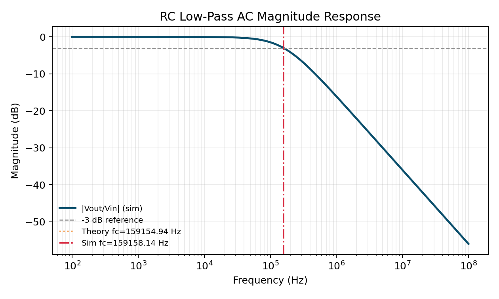
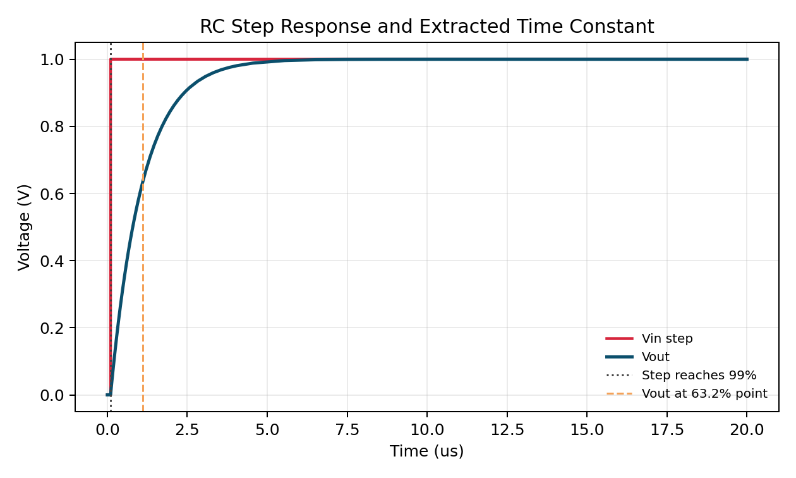

# Lab 01: RC Low-Pass Fundamentals

## 1) What you will learn

- Compute the first-order low-pass cutoff frequency and time constant from `R` and `C`.
- Run AC and transient simulations from repo root using explicit ASDL and Xyce commands.
- Quantitatively compare theory and simulation against explicit tolerances.
- Explain the bandwidth-versus-settling tradeoff when the RC product changes.

## 2) Circuit overview

This lab uses a one-pole passive RC low-pass: a series resistor `R` from input to output, and a capacitor `C` from output to ground. The output node is the resistor-capacitor junction.

- Baseline values: `R = 1 kOhm`, `C = 1 nF`.
- Input for AC run: small-signal source with `AC = 1`.
- Input for transient run: 0 V to 1 V pulse.
- Practical relevance: this cell appears in anti-aliasing, bias filtering, and compensation paths.

## 3) Theory (pre-simulation)

For an ideal first-order RC low-pass:

- Transfer magnitude: `|H(jw)| = 1 / sqrt(1 + (wRC)^2)`
- Cutoff frequency: `f_c = 1 / (2*pi*R*C)`
- Time constant: `tau = R*C`

With `R = 1e3` and `C = 1e-9`:

- `tau_theory = 1.0e-6 s`
- `f_c,theory = 159154.943 Hz`

Acceptance thresholds used in this lab:

- cutoff frequency error <= `+-5%`
- time-constant error <= `+-10%`

## 4) ASDL simulation setup

Source files:

- `labs/lab-01-rc-lowpass/asdl/tb.asdl` (AC sweep)
- `labs/lab-01-rc-lowpass/asdl/tb_tran.asdl` (transient step)
- `labs/lab-01-rc-lowpass/asdl/stimuli.asdl` (local source primitive for AC+PULSE)

Run from repo root:

```bash
# sanity compile
asdlc netlist labs/lab-01-rc-lowpass/asdl/tb.asdl --backend sim.xyce
asdlc netlist labs/lab-01-rc-lowpass/asdl/tb_tran.asdl --backend sim.xyce

# compile to run folder
asdlc netlist labs/lab-01-rc-lowpass/asdl/tb.asdl --backend sim.xyce -o runs/lab-01-rc-lowpass/20260324-baseline/tb.spice
asdlc netlist labs/lab-01-rc-lowpass/asdl/tb_tran.asdl --backend sim.xyce -o runs/lab-01-rc-lowpass/20260324-baseline/tb_tran.spice

# simulate
xyce runs/lab-01-rc-lowpass/20260324-baseline/tb.spice
xyce runs/lab-01-rc-lowpass/20260324-baseline/tb_tran.spice

# post-process and plot
./venv/bin/python labs/lab-01-rc-lowpass/scripts/postprocess.py --run runs/lab-01-rc-lowpass/20260324-baseline --out labs/lab-01-rc-lowpass/figures/data
./venv/bin/python labs/lab-01-rc-lowpass/scripts/plot.py --data labs/lab-01-rc-lowpass/figures/data --out labs/lab-01-rc-lowpass/figures
```

## 5) Results

`fig1_ac_response.png` shows the low-frequency passband and the -3 dB rolloff crossing.



`fig2_transient_step.png` shows the input step and output exponential charging behavior.



Derived artifacts:

- `labs/lab-01-rc-lowpass/figures/data/ac_response.csv`
- `labs/lab-01-rc-lowpass/figures/data/transient_response.csv`
- `labs/lab-01-rc-lowpass/figures/data/metrics.json`
- `labs/lab-01-rc-lowpass/figures/data/theory_vs_sim.csv`

## 6) Theory vs simulation

| Metric | Theory | Simulation | Error (%) | Tolerance | Pass |
|---|---:|---:|---:|---:|---:|
| Cutoff frequency (Hz) | 159154.943 | 159158.142 | +0.0020 | +-5.0 | yes |
| Time constant (s) | 1.0000e-6 | 9.9997e-7 | -0.0032 | +-10.0 | yes |

Both measured metrics pass with large margin.

## 7) Tradeoff demonstrated

The RC product controls both frequency-domain bandwidth and time-domain speed.

- Larger `R` or `C` increases `tau`, so output settles more slowly after a step.
- The same larger RC product decreases `f_c`, reducing signal bandwidth.
- Smaller `R` or `C` does the opposite: faster settling and higher cutoff.

This lab baseline demonstrates that these two behaviors are linked by the same parameter pair (`R*C`).

## 8) Friction log (workflow/tooling)

- First failing command:
  - `xyce runs/lab-01-rc-lowpass/20260324-baseline/tb.spice`
- Exact error text:
  - `Netlist error: Analysis type AC and print type TRAN are inconsistent.`
- Root cause:
  - Xyce rejected a single deck containing mixed AC and TRAN print directives.
- Fix applied:
  - Split into two benches (`tb.asdl` for AC and `tb_tran.asdl` for transient) under the same lab.
- Suggested guidance update:
  - Add a note in `agents/instructions/debugging.md` for this Xyce analysis/print mismatch and preferred split-deck workaround.

## 9) Reproducibility checklist

- [x] Compile commands are explicit and run from repo root.
- [x] Simulation commands are explicit and produce deterministic files for run id `20260324-baseline`.
- [x] Post-processing and plotting scripts are checked in and runnable.
- [x] Figures in `labs/lab-01-rc-lowpass/figures/` are script-generated from run artifacts.
- [x] Theory-vs-simulation metrics are exported and pass stated tolerances.
